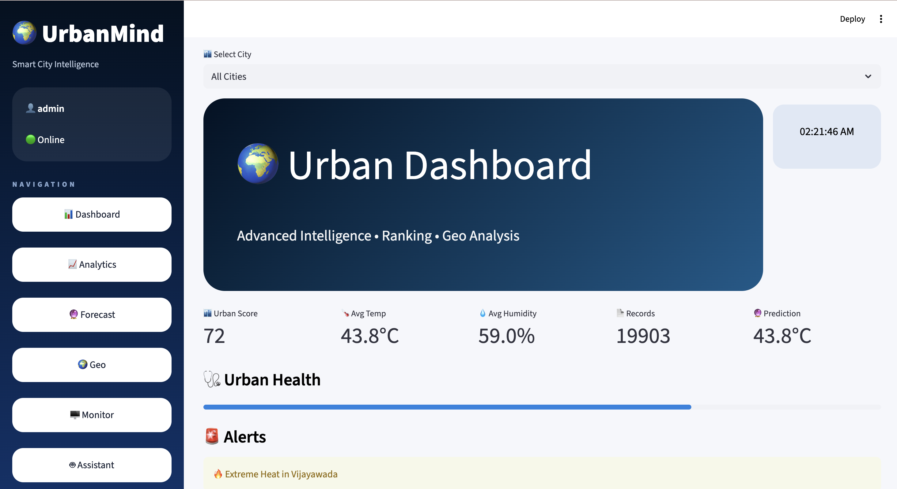
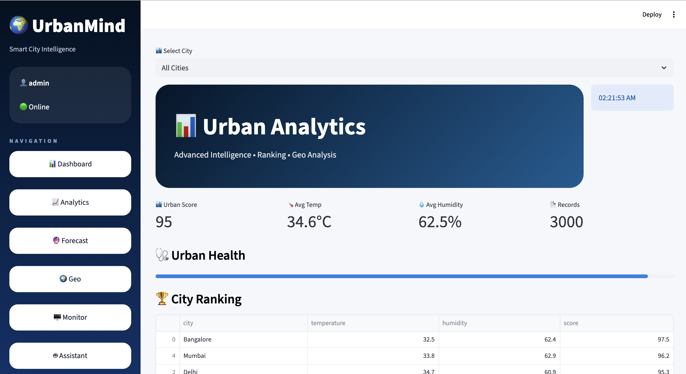
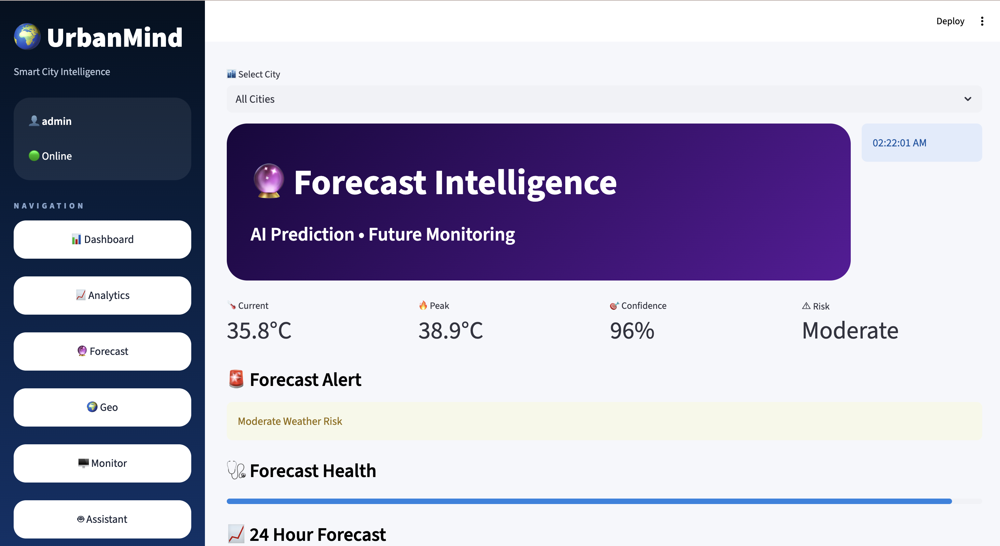
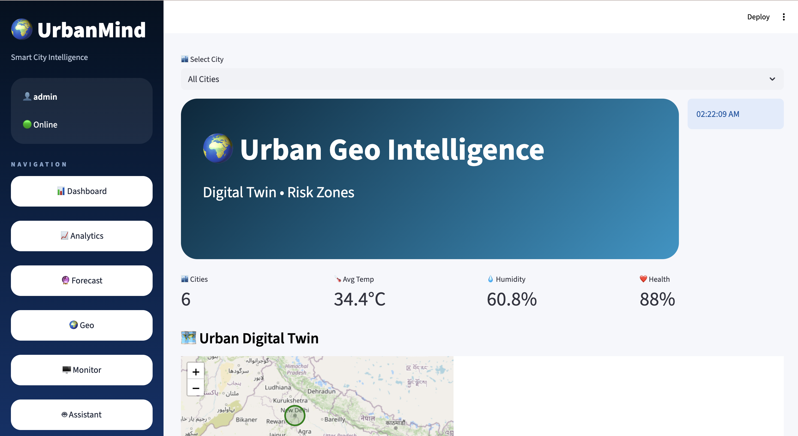
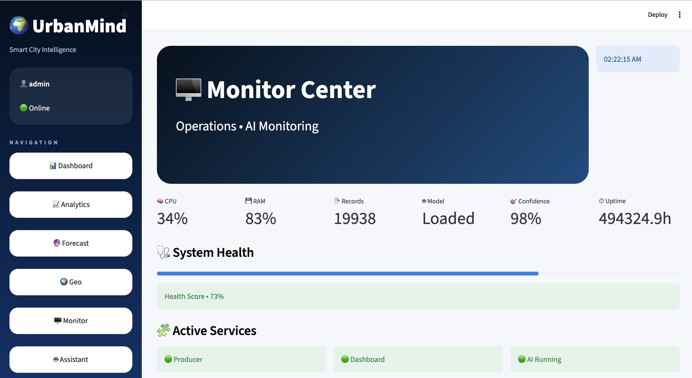
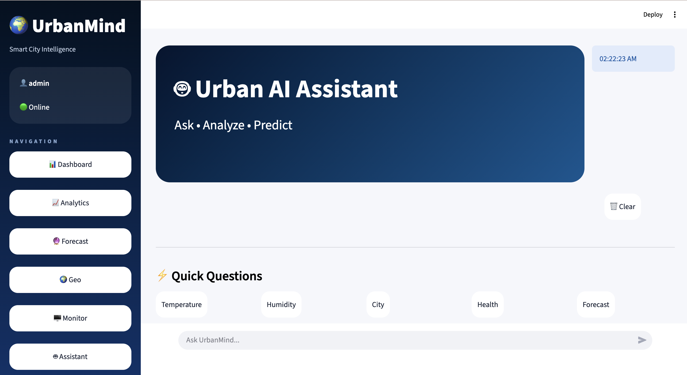
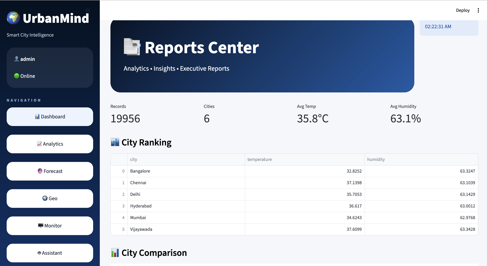
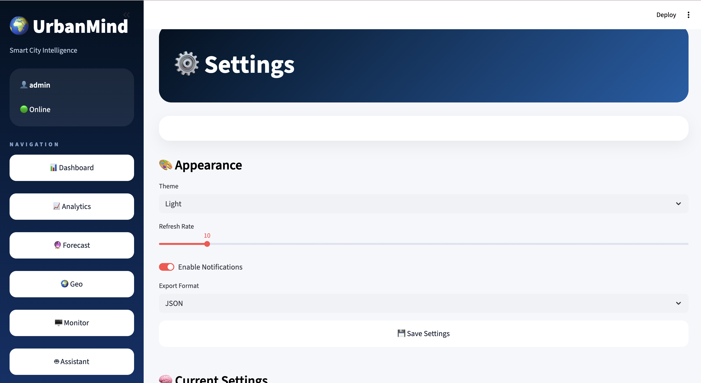

<p align="center">
  
</p>

<h1 align="center">🌍 UrbanMind</h1>

<h3 align="center">
Real-Time Big Data Platform for Urban Intelligence and Predictive Decision Support
</h3>

<p align="center">


</p>

---

# 🚀 Overview

UrbanMind is an AI-powered Smart City Intelligence Platform designed to collect, process, analyze, predict, and visualize urban environmental intelligence using Big Data and Machine Learning.

The platform integrates:

- Real-time analytics
- Forecast intelligence
- Monitoring dashboards
- Geospatial insights
- AI assistance
- Predictive modeling
- Production-ready deployment

---

# ✨ Features

## 📊 Analytics Dashboard
Analyze environmental and urban metrics in real time.

## 🔮 Forecast Intelligence
Generate weather and urban predictions.

## 🌍 Geo Intelligence
Visualize locations and urban conditions.

## 🖥 Monitor Center
Monitor platform health and operations.

## 🤖 Urban AI Assistant
Interactive assistant for insights.

## 🧠 Machine Learning Prediction
AI-driven predictive analysis.

## 🐳 Docker Deployment
Containerized production architecture.

---

# 🏗 System Architecture

```text
             ┌────────────────────┐
             │     Frontend       │
             │     Streamlit      │
             └─────────┬──────────┘
                       │
                       ▼

             ┌────────────────────┐
             │     FastAPI API    │
             │    Backend Layer   │
             └─────────┬──────────┘
                       │
                       ▼

             ┌────────────────────┐
             │ Machine Learning   │
             │ Prediction Engine  │
             └─────────┬──────────┘
                       │
                       ▼

             ┌────────────────────┐
             │ Data Processing    │
             │ Urban Intelligence │
             └────────────────────┘
```

---

# 📸 Platform Screenshots

## Dashboard


---

## Analytics



---

## Forecast



---

## Geo Intelligence



---

## Monitor Center



---

## Urban AI Assistant



---

## Reports



---

## Settings



---

# ⚙ Installation

## Clone Repository

```bash
git clone https://github.com/RevanthSettipalli/UrbanMind.git
```

Move into project:

```bash
cd UrbanMind
```

Create environment:

```bash
python -m venv venv
```

Activate environment:

Mac/Linux

```bash
source venv/bin/activate
```

Windows

```bash
venv\Scripts\activate
```

Install packages:

```bash
pip install -r requirements.txt
```

---

# ▶ Run Backend

```bash
uvicorn backend.api.app:app --reload
```

API:

```text
http://localhost:8000
```

Swagger:

```text
http://localhost:8000/docs
```

---

# ▶ Run Frontend

```bash
streamlit run frontend/app.py
```

Open:

```text
http://localhost:8502
```

---

# 🧠 Machine Learning Model

### Algorithm

```text
RandomForestRegressor
```

### Current Metrics

```text
MAE : 3.821
R²  : 0.267
```

### Model Output

- Temperature Prediction
- Forecast Insights
- Urban Health Analysis
- Recommendation Engine

---

# 📂 Project Structure

```text
UrbanMind
│
├── assets/
│
├── backend/
│   ├── api/
│   ├── auth/
│   ├── ml/
│
├── frontend/
│   ├── pages/
│   ├── utils/
│
├── data/
│
├── docs/
│
├── tests/
│
├── Dockerfile
├── docker-compose.yml
├── requirements.txt
├── README.md
```

---

# 🐳 Docker

Build:

```bash
docker-compose build
```

Run:

```bash
docker-compose up
```

---

# 🔥 Future Enhancements

- Real-time streaming
- Advanced forecasting
- LLM integration
- Kubernetes deployment
- Mobile dashboard
- Multi-city intelligence

---

# 📈 Project Goals

UrbanMind aims to become an intelligent urban analytics ecosystem capable of:

✔ Predictive Decision Support  
✔ Smart Monitoring  
✔ AI Insights  
✔ Big Data Analytics  
✔ Scalable Deployment

---

# 👨‍💻 Author

### Revanth Settipalli

GitHub:

https://github.com/RevanthSettipalli

---

<p align="center">

⭐ Star this repository if you like UrbanMind ⭐

</p>
